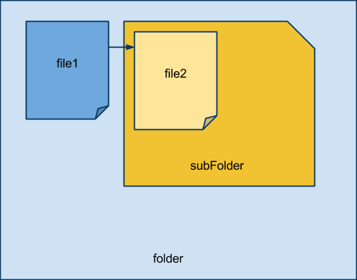
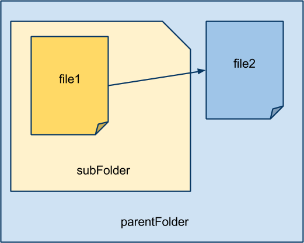

#Linking files

* [Link Tag]()
* [Folder](folders.html)
* [Images](images.html)
* [Image Types](image-types.html)
* [Image Examples](image-examples.html)
* [Homework](homework.html)

##Linking to a file in the same folder
If the two files are in the same folder than file 1 can call file 2 by the file name only.

###Example
`<a href=”file2.html”>link</a>`
``

##Linking to a file in a sub folder
If the file you wish to link to is a sub folder you can not link to the file directly. Instead you need declare the folder name and the file name.

When linking to a file in a sub folder you need to know the folder name.  Because it possible to have more than one sub folder it is necessary to know the folder name. 

###Example
`<a href=”subFolder/file2.html”>link</a>`
``

##Linking to a file in a parent folder

When linking to a file that is in a parent folder (up a directory) you need to indecate that you are going up a directory.  This is done by adding a `../` for every folder that you want to go up.

###Example
`<a href=”../file2.html”>link</a>`
``		
